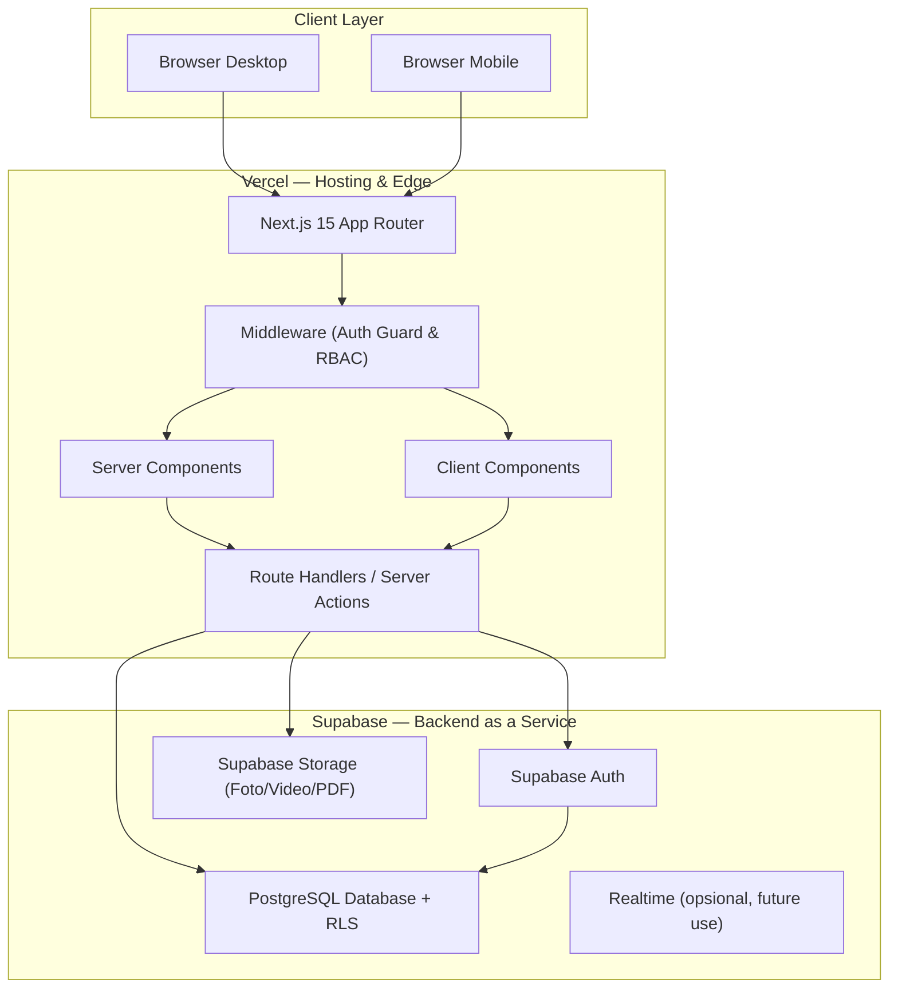
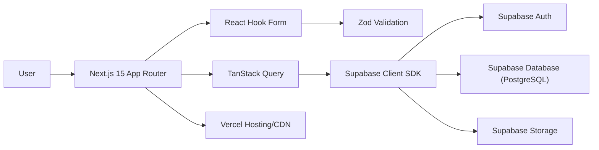
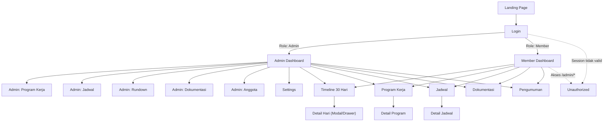
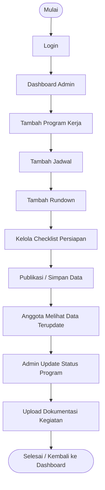
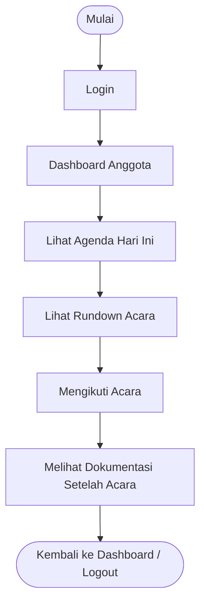
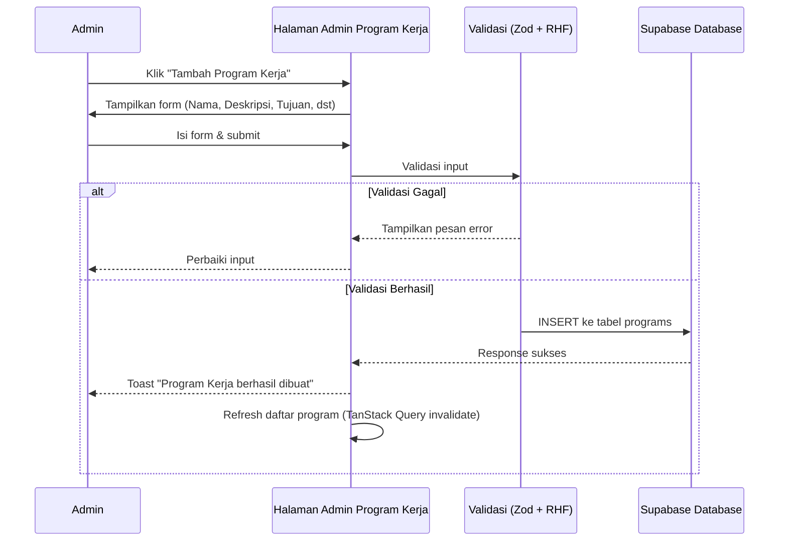
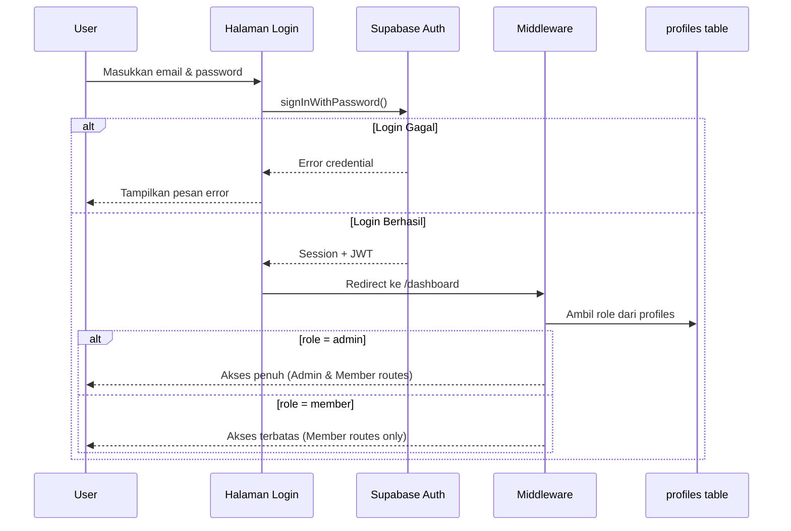
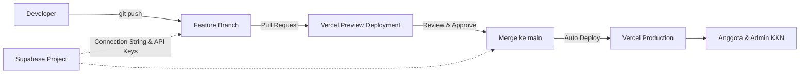
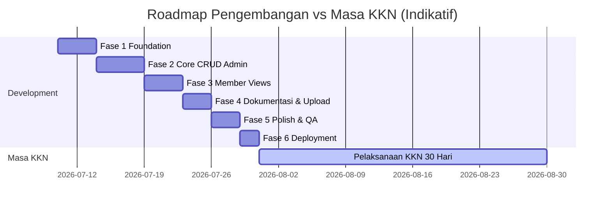

# Product Requirements Document (PRD)
## KKN Desa Bambang Management System

| | |
|---|---|
| **Dokumen** | Product Requirements Document (PRD) |
| **Nama Produk** | KKN Desa Bambang Management System |
| **Versi Dokumen** | 1.0.0 |
| **Status** | Draft — Ready for Development |
| **Klasifikasi** | Internal / Confidential — Kelompok KKN 11 |
| **Durasi Program** | 30 Hari |
| **Dibuat oleh** | Senior Product Manager & Senior Software Architect (disusun untuk Kelompok KKN 11) |
| **Terakhir Diperbarui** | 2026 |

---

## Daftar Isi

1. [Ringkasan Eksekutif](#1-ringkasan-eksekutif)
2. [Latar Belakang & Permasalahan](#2-latar-belakang-permasalahan)
3. [Tujuan Produk & Success Metrics](#3-tujuan-produk-success-metrics)
4. [Ruang Lingkup (Scope)](#4-ruang-lingkup-scope)
5. [Persona Pengguna](#5-persona-pengguna)
6. [User Roles & Permission Matrix](#6-user-roles-permission-matrix)
7. [Daftar Program Kerja](#7-daftar-program-kerja)
8. [Functional Requirements](#8-functional-requirements)
9. [Non-Functional Requirements](#9-non-functional-requirements)
10. [Arsitektur Sistem](#10-arsitektur-sistem)
11. [Tech Stack](#11-tech-stack)
12. [Perancangan Database](#12-perancangan-database)
13. [Information Architecture & Sitemap](#13-information-architecture-sitemap)
14. [Daftar Halaman (Page List)](#14-daftar-halaman-page-list)
15. [Daftar Komponen UI](#15-daftar-komponen-ui)
16. [User Flow](#16-user-flow)
17. [Wireframe Deskriptif (Low-Fidelity)](#17-wireframe-deskriptif-low-fidelity)
18. [State Management & Data Fetching Strategy](#18-state-management-data-fetching-strategy)
19. [Validasi & Form Handling](#19-validasi-form-handling)
20. [Keamanan (Security)](#20-keamanan-security)
21. [Analytics & Logging](#21-analytics-logging)
22. [Deployment & Environment](#22-deployment-environment)
23. [Testing Strategy](#23-testing-strategy)
24. [Milestones & Roadmap Pengembangan](#24-milestones-roadmap-pengembangan)
25. [Risk Assessment](#25-risk-assessment)
26. [Future Features (Versi 2.0)](#26-future-features-versi-20)
27. [Glosarium](#27-glosarium)
28. [Lampiran](#28-lampiran)

---

## 1. Ringkasan Eksekutif

**KKN Desa Bambang Management System** adalah aplikasi web internal (bukan website profil publik) yang dirancang sebagai **pusat kendali operasional (operational command center)** bagi seluruh anggota Kelompok KKN 11 selama masa pengabdian 30 hari di Desa Bambang.

Aplikasi ini menggantikan kombinasi alat kerja yang saat ini terfragmentasi — WhatsApp Group, dokumen Word, folder foto tersebar, dan komunikasi lisan — menjadi **satu sumber kebenaran tunggal (single source of truth)** yang dapat diakses kapan saja oleh seluruh anggota, dengan dua tingkat akses: **Admin** (pengendali data) dan **Anggota** (konsumen informasi).

Produk ini **bukan** website company profile atau landing page publikasi kegiatan KKN untuk masyarakat umum. Ini adalah **dashboard operasional internal** yang fokus pada efisiensi koordinasi tim, transparansi progres program kerja, dan kemudahan akses jadwal serta dokumentasi selama periode KKN berlangsung.

### Ringkasan Kebutuhan Bisnis

| Aspek | Deskripsi Singkat |
|---|---|
| **Masalah Utama** | Informasi kegiatan KKN tersebar di banyak platform sehingga sulit dilacak dan menyebabkan pertanyaan berulang |
| **Solusi** | Dashboard terpusat dengan role-based access control (Admin & Anggota) |
| **Target Pengguna** | ± 10–15 anggota Kelompok KKN 11 |
| **Durasi Pemakaian** | 30 hari masa KKN aktif + periode arsip pasca-KKN |
| **Platform** | Web application, mobile-first, responsive |
| **Model Deployment** | Vercel (frontend/serverless) + Supabase (backend-as-a-service) |

---

## 2. Latar Belakang & Permasalahan

### 2.1 Konteks

Kelompok KKN 11 melaksanakan program Kuliah Kerja Nyata selama 30 hari dengan 11 program kerja yang harus dikoordinasikan oleh seluruh anggota, dibagi dalam struktur kepengurusan (Ketua, Sekretaris, PJ Divisi Acara, dan anggota pelaksana). Selama pelaksanaan, koordinasi bergantung pada kanal komunikasi informal yang tidak terstruktur.

### 2.2 Permasalahan yang Diidentifikasi

| # | Masalah | Dampak | Akar Penyebab |
|---|---|---|---|
| P1 | Jadwal tersebar di grup WhatsApp | Anggota kehilangan jadwal penting karena chat tertimbun pesan lain | Tidak ada sistem penyimpanan jadwal terstruktur |
| P2 | Rundown disimpan di file Word terpisah | Versi rundown tidak konsisten antar anggota, rawan versi ganda/kadaluarsa | Tidak ada version control terpusat |
| P3 | Dokumentasi (foto/video/laporan) tersebar | Sulit mengumpulkan bahan untuk laporan akhir KKN | Tidak ada repository terpusat |
| P4 | Sulit mengetahui progress program kerja | Ketua/PJ tidak punya visibilitas real-time atas status 11 program kerja | Tidak ada sistem tracking status |
| P5 | Banyak anggota bertanya berulang mengenai jadwal | Menghabiskan waktu admin untuk menjawab pertanyaan yang sama | Tidak ada akses mandiri (self-service) bagi anggota |

### 2.3 Dampak Bisnis Jika Tidak Diselesaikan

- Miskoordinasi antar divisi yang berpotensi menyebabkan program kerja terlambat atau tidak terlaksana.
- Hilangnya dokumentasi penting yang dibutuhkan untuk laporan pertanggungjawaban (LPJ) KKN.
- Beban kerja berlebih pada Ketua dan Sekretaris karena harus menjawab pertanyaan repetitif secara manual.
- Kesan tidak profesional terhadap Dosen Pembimbing Lapangan (DPL) dan pihak desa saat monitoring dan evaluasi.

---

## 3. Tujuan Produk & Success Metrics

### 3.1 Tujuan Produk (Goals)

1. Menjadi **satu-satunya sumber informasi resmi** terkait jadwal, rundown, program kerja, dan dokumentasi KKN Kelompok 11.
2. Memberikan **visibilitas real-time** terhadap progres seluruh program kerja kepada Admin maupun Anggota.
3. Mengurangi **beban komunikasi manual** Admin dengan menyediakan akses swalayan (self-service) bagi Anggota.
4. Menyediakan **arsip digital** dokumentasi kegiatan yang rapi untuk kebutuhan laporan akhir KKN.
5. Meningkatkan **profesionalisme** citra Kelompok KKN 11 di mata DPL, perangkat desa, dan pihak kampus.

### 3.2 Non-Goals (Yang Bukan Tujuan Produk Ini)

- Bukan website publikasi/promosi KKN untuk masyarakat umum (tidak ada fitur SEO, blog publik, atau company profile marketing).
- Bukan sistem manajemen keuangan/anggaran KKN.
- Bukan sistem presensi otomatis berbasis GPS/biometrik (fitur presensi lanjutan masuk ke Future Features).
- Bukan platform komunikasi real-time pengganti WhatsApp (chat internal masuk ke Future Features v2).

### 3.3 Success Metrics (Indikator Keberhasilan)

| Metrik | Target | Cara Pengukuran |
|---|---|---|
| Adoption Rate | 100% anggota kelompok memiliki akun aktif dalam 2 hari pertama peluncuran | Jumlah akun terdaftar vs total anggota |
| Engagement | Minimal 80% anggota membuka Dashboard setiap hari selama masa KKN | Login log / session count |
| Reduksi Pertanyaan Repetitif | Penurunan pertanyaan "jadwal hari ini apa?" di WhatsApp Group sebesar 70% | Observasi kualitatif oleh Admin |
| Kelengkapan Dokumentasi | 100% program kerja memiliki minimal 1 dokumentasi (foto/laporan) setelah selesai | Jumlah dokumen per program kerja |
| Update Status Program | Status program kerja diperbarui maksimal 1x24 jam setelah kegiatan selesai | Timestamp `updated_at` pada tabel `programs` |
| Performa Aplikasi | Waktu muat halaman (Largest Contentful Paint) < 2.5 detik pada koneksi 4G | Lighthouse / Web Vitals |

---

## 4. Ruang Lingkup (Scope)

### 4.1 In-Scope (Termasuk dalam Versi 1.0)

- Autentikasi berbasis Supabase Auth dengan dua role: Admin dan Anggota.
- CRUD Program Kerja, Jadwal, Rundown, Pengumuman, Dokumentasi, Checklist, dan Anggota (khusus Admin).
- Dashboard ringkasan (hari ke-, countdown, progress, pengumuman terbaru, quick access).
- Timeline visual 30 hari dengan detail per hari (agenda, lokasi, PIC, rundown, status).
- Upload file (foto, video, PDF, laporan) ke Supabase Storage.
- Sistem checklist persiapan acara per program kerja.
- Tampilan progress program kerja (total, selesai, berjalan, belum dimulai).
- Desain responsive, mobile-first, dengan UI modern minimalis.

### 4.2 Out-of-Scope (Tidak Termasuk dalam Versi 1.0)

- QR Code Attendance / presensi digital.
- Notifikasi real-time / push notification.
- Export ke PDF/Word otomatis dari sistem.
- Sinkronisasi kalender eksternal (Google Calendar, dsb).
- Progressive Web App (PWA) dan mode offline.
- Dark mode.
- Fitur chat internal.
- Analytics mendalam (heatmap, funnel, dsb).

> Seluruh item di atas didokumentasikan lebih lanjut pada [Bagian 26 — Future Features](#26-future-features-versi-20).

---

## 5. Persona Pengguna

### 5.1 Persona 1 — "Ketua Kelompok" (Admin — Decision Maker)

| Atribut | Detail |
|---|---|
| Nama Peran | Ketua Kelompok KKN 11 |
| Tujuan Utama | Memastikan seluruh program kerja berjalan sesuai rencana dan terdokumentasi dengan baik |
| Tugas Sehari-hari | Meninjau dashboard progres, mengonfirmasi status program, membuat pengumuman penting |
| Pain Point Sebelumnya | Kesulitan mendapatkan gambaran menyeluruh progres 11 program kerja secara cepat |
| Ekspektasi terhadap Produk | Dashboard yang informatif dan cepat memberi gambaran status keseluruhan |
| Frekuensi Akses | Setiap hari, beberapa kali (pagi, siang, malam) |

### 5.2 Persona 2 — "Sekretaris" (Admin — Operator Data)

| Atribut | Detail |
|---|---|
| Nama Peran | Sekretaris Kelompok KKN 11 |
| Tujuan Utama | Mengelola input data jadwal, rundown, dan dokumen administratif secara rapi |
| Tugas Sehari-hari | Menginput jadwal harian, mengunggah dokumentasi, memperbarui rundown acara |
| Pain Point Sebelumnya | Rundown tersimpan di banyak file Word versi berbeda, rawan kesalahan versi |
| Ekspektasi terhadap Produk | Form input yang sederhana dan validasi yang jelas agar data tidak salah masuk |
| Frekuensi Akses | Setiap hari, terutama menjelang dan sesudah kegiatan |

### 5.3 Persona 3 — "PJ Divisi Acara" (Admin — Event Coordinator)

| Atribut | Detail |
|---|---|
| Nama Peran | Penanggung Jawab Divisi Acara |
| Tujuan Utama | Mengelola detail teknis acara (rundown, checklist persiapan, PIC per sesi) |
| Tugas Sehari-hari | Menyusun rundown acara, mencentang checklist persiapan (banner, sound, konsumsi, dll) |
| Pain Point Sebelumnya | Checklist persiapan dicatat manual di kertas/chat, mudah terlewat |
| Ekspektasi terhadap Produk | Checklist digital yang bisa dicentang bersama dan terlihat oleh semua PJ |
| Frekuensi Akses | Tinggi menjelang H-1 dan hari-H acara |

### 5.4 Persona 4 — "Anggota Pelaksana" (Member — Konsumen Informasi)

| Atribut | Detail |
|---|---|
| Nama Peran | Anggota Kelompok KKN 11 (non-pengurus inti) |
| Tujuan Utama | Mengetahui jadwal, lokasi, dan agenda kegiatan tanpa harus bertanya berulang |
| Tugas Sehari-hari | Membuka dashboard tiap pagi untuk melihat agenda hari ini dan pengumuman |
| Pain Point Sebelumnya | Harus scroll WhatsApp Group untuk mencari info jadwal yang sudah tenggelam |
| Ekspektasi terhadap Produk | Informasi cepat ditemukan, tampilan simpel, tidak perlu training untuk memakainya |
| Frekuensi Akses | Setiap hari, minimal 1–2 kali |

---

## 6. User Roles & Permission Matrix

### 6.1 Definisi Role

| Role | Kode Role (DB) | Anggota yang Termasuk |
|---|---|---|
| **Admin** | `admin` | Ketua, Sekretaris, PJ Divisi Acara |
| **Anggota** | `member` | Seluruh anggota kelompok KKN selain di atas |

### 6.2 Permission Matrix Lengkap

Legenda: ✅ = Diizinkan penuh · 👁️ = Hanya lihat (read-only) · ❌ = Tidak diizinkan

| Modul / Fitur | Admin | Anggota |
|---|:---:|:---:|
| Login / Logout | ✅ | ✅ |
| Melihat Dashboard | ✅ | ✅ |
| Melihat Timeline 30 Hari | ✅ | 👁️ |
| Membuat Program Kerja | ✅ | ❌ |
| Mengedit Program Kerja | ✅ | ❌ |
| Menghapus Program Kerja | ✅ | ❌ |
| Melihat Program Kerja | ✅ | 👁️ |
| Mengubah Status Program Kerja | ✅ | ❌ |
| Membuat Jadwal | ✅ | ❌ |
| Mengedit Jadwal | ✅ | ❌ |
| Menghapus Jadwal | ✅ | ❌ |
| Melihat Jadwal | ✅ | 👁️ |
| Membuat Rundown | ✅ | ❌ |
| Mengedit Rundown | ✅ | ❌ |
| Menghapus Rundown | ✅ | ❌ |
| Melihat Rundown | ✅ | 👁️ |
| Membuat Pengumuman | ✅ | ❌ |
| Mengedit Pengumuman | ✅ | ❌ |
| Menghapus Pengumuman | ✅ | ❌ |
| Melihat Pengumuman | ✅ | 👁️ |
| Upload Dokumentasi (Foto/Video/PDF/Laporan) | ✅ | ❌ |
| Menghapus Dokumentasi | ✅ | ❌ |
| Melihat Dokumentasi | ✅ | 👁️ |
| Download File | ✅ | ✅ |
| Membuat Checklist | ✅ | ❌ |
| Mencentang Checklist | ✅ | ❌ |
| Melihat Checklist | ✅ | 👁️ |
| Menambah Anggota | ✅ | ❌ |
| Mengedit Data Anggota | ✅ | ❌ |
| Menghapus Anggota | ✅ | ❌ |
| Melihat Daftar Anggota | ✅ | ❌ |
| Mengakses Halaman Settings | ✅ | ❌ |
| Mengakses Panel Admin (`/admin/*`) | ✅ | ❌ (redirect ke Unauthorized) |

### 6.3 Aturan Enforcement Permission

1. **Enforcement di dua lapisan (defense in depth):**
   - **Lapisan UI (Client-side):** Middleware Next.js memeriksa role sebelum merender halaman `/admin/*`; jika role tidak sesuai, redirect ke halaman `/unauthorized`.
   - **Lapisan Data (Server-side):** Row Level Security (RLS) Supabase PostgreSQL memastikan mutasi data (`INSERT`, `UPDATE`, `DELETE`) hanya bisa dilakukan oleh `role = 'admin'`, terlepas dari apakah request datang dari UI resmi atau API call langsung.
2. Role pengguna disimpan di tabel `profiles.role` dan divalidasi ulang di setiap request melalui Supabase session/JWT claim — tidak boleh disimpan hanya di client-side state.
3. Anggota yang mencoba mengakses endpoint mutasi data (misalnya melalui DevTools atau direct API call) akan menerima response `403 Forbidden` dari RLS policy Supabase, bukan hanya diblokir di UI.

---

## 7. Daftar Program Kerja

Total terdapat **11 Program Kerja** yang dikelola dalam sistem ini.

| No | Nama Program Kerja | Kategori (Indikatif) |
|---|---|---|
| 1 | Sosialisasi dan Pembuatan Lubang Biopori | Lingkungan |
| 2 | Revitalisasi Plang Informasi dan Penunjuk Arah | Infrastruktur |
| 3 | Gerakan Kerja Bakti Saluran Air | Lingkungan |
| 4 | Program Relawan Mengajar Formal | Pendidikan |
| 5 | Bimbingan Belajar Nonformal | Pendidikan |
| 6 | Pelatihan Literasi Komputer Dasar | Pendidikan & Teknologi |
| 7 | Program Mengajar Ngaji | Keagamaan |
| 8 | Digitalisasi UMKM | Ekonomi & Teknologi |
| 9 | Seminar Parenting | Sosial & Keluarga |
| 10 | Malam Keakraban (Makrab & Nobar) | Sosial & Kebersamaan |
| 11 | Instalasi Pembakaran Sampah Anorganik (Bebas Asap) | Lingkungan & Infrastruktur |

> **Catatan Implementasi:** Kolom "Kategori" bersifat indikatif untuk kebutuhan pengelompokan dan filter di UI. Kategori dapat disesuaikan oleh Admin saat data seeding awal, dan disimpan sebagai kolom `category` (nullable, free-text atau enum sederhana) pada tabel `programs`.

---

## 8. Functional Requirements

Setiap functional requirement diberi kode unik `FR-XX` untuk kemudahan traceability ke tahap development dan testing.

### 8.1 Modul: Authentication

| Kode | Requirement | Prioritas |
|---|---|---|
| FR-01 | Sistem harus menyediakan halaman login menggunakan email & password melalui Supabase Auth | Must Have |
| FR-02 | Sistem harus mengarahkan pengguna ke Dashboard sesuai role setelah login berhasil | Must Have |
| FR-03 | Sistem harus menampilkan pesan error yang jelas saat login gagal (email/password salah) | Must Have |
| FR-04 | Sistem harus menyediakan fungsi logout yang menghapus session secara aman | Must Have |
| FR-05 | Sistem harus melindungi seluruh route selain Landing dan Login dengan session check (middleware) | Must Have |
| FR-06 | Sistem harus mengarahkan pengguna yang belum login ke halaman Login saat mengakses route terproteksi | Must Have |
| FR-07 | Sistem harus mengarahkan Anggota ke halaman Unauthorized saat mencoba mengakses route Admin | Must Have |

### 8.2 Modul: Dashboard

| Kode | Requirement | Prioritas |
|---|---|---|
| FR-08 | Dashboard harus menampilkan "Hari ke-N" dari total 30 hari masa KKN, dihitung otomatis dari tanggal mulai yang dikonfigurasi di Settings | Must Have |
| FR-09 | Dashboard harus menampilkan countdown mundur hari tersisa hingga KKN berakhir | Must Have |
| FR-10 | Dashboard harus menampilkan daftar program kerja yang dijadwalkan pada hari ini | Must Have |
| FR-11 | Dashboard harus menampilkan jadwal kegiatan hari ini secara ringkas (waktu, nama kegiatan) | Must Have |
| FR-12 | Dashboard harus menampilkan ringkasan progress program kerja (total, selesai, berjalan, belum dimulai) dalam bentuk visual (progress bar/chart) | Must Have |
| FR-13 | Dashboard harus menampilkan progress checklist persiapan acara terdekat | Should Have |
| FR-14 | Dashboard harus menampilkan 3–5 pengumuman terbaru | Must Have |
| FR-15 | Dashboard harus menyediakan Quick Access (shortcut) ke modul: Timeline, Program Kerja, Jadwal, Dokumentasi | Should Have |
| FR-16 | Dashboard Admin harus menampilkan ringkasan tambahan: jumlah anggota terdaftar, jumlah dokumentasi terunggah bulan ini | Could Have |

### 8.3 Modul: Timeline 30 Hari

| Kode | Requirement | Prioritas |
|---|---|---|
| FR-17 | Sistem harus menampilkan visual timeline dari Hari 1 hingga Hari 30 secara berurutan | Must Have |
| FR-18 | Setiap hari pada timeline harus menunjukkan indikator status (belum berlangsung, sedang berlangsung, sudah lewat, memiliki kegiatan/tidak) | Must Have |
| FR-19 | Setiap hari yang diklik harus membuka detail berisi: Agenda, Lokasi, PIC, Rundown, dan Status | Must Have |
| FR-20 | Sistem harus menyorot (highlight) hari yang sedang berjalan (hari ini) secara visual berbeda dari hari lainnya | Should Have |
| FR-21 | Anggota dapat melihat seluruh detail timeline namun tidak dapat mengedit data apa pun dari tampilan ini | Must Have |

### 8.4 Modul: Program Kerja

| Kode | Requirement | Prioritas |
|---|---|---|
| FR-22 | Admin dapat membuat Program Kerja baru dengan field: Nama, Deskripsi, Tujuan, Sasaran, Lokasi, Tanggal, PJ, Status | Must Have |
| FR-23 | Admin dapat mengedit seluruh field Program Kerja yang sudah dibuat | Must Have |
| FR-24 | Admin dapat menghapus Program Kerja (dengan konfirmasi dialog untuk mencegah penghapusan tidak sengaja) | Must Have |
| FR-25 | Admin dapat mengubah Status Program Kerja: `Belum Dimulai`, `Berjalan`, `Selesai` | Must Have |
| FR-26 | Sistem harus menampilkan daftar seluruh 11 Program Kerja dalam bentuk grid/list card | Must Have |
| FR-27 | Setiap Program Kerja harus memiliki halaman detail yang menampilkan seluruh atribut, Checklist terkait, Rundown terkait, dan Dokumentasi terkait | Must Have |
| FR-28 | Anggota hanya dapat melihat daftar dan detail Program Kerja tanpa hak edit | Must Have |
| FR-29 | Sistem harus menyediakan filter/pencarian Program Kerja berdasarkan Status atau Kategori | Should Have |

### 8.5 Modul: Rundown

| Kode | Requirement | Prioritas |
|---|---|---|
| FR-30 | Admin dapat menambahkan item rundown dengan field: Jam, Nama Kegiatan, PIC, Keterangan | Must Have |
| FR-31 | Admin dapat mengedit dan menghapus item rundown | Must Have |
| FR-32 | Rundown harus terhubung (associated) dengan Program Kerja dan/atau Jadwal Harian tertentu | Must Have |
| FR-33 | Rundown harus ditampilkan terurut berdasarkan Jam secara ascending | Must Have |
| FR-34 | Anggota hanya dapat melihat rundown tanpa hak edit | Must Have |

### 8.6 Modul: Jadwal

| Kode | Requirement | Prioritas |
|---|---|---|
| FR-35 | Admin dapat menambahkan Jadwal baru dengan field minimal: Tanggal, Waktu, Nama Kegiatan, Lokasi, Deskripsi, Program Kerja terkait (opsional) | Must Have |
| FR-36 | Admin dapat mengedit Jadwal yang sudah ada | Must Have |
| FR-37 | Admin dapat menghapus Jadwal (dengan konfirmasi) | Must Have |
| FR-38 | Sistem harus menampilkan Jadwal dalam tampilan kalender dan/atau list, terurut berdasarkan tanggal & waktu | Must Have |
| FR-39 | Anggota hanya dapat melihat Jadwal tanpa hak edit | Must Have |
| FR-40 | Sistem harus menampilkan detail jadwal (halaman detail) berisi seluruh informasi terkait acara tersebut | Should Have |

### 8.7 Modul: Dokumentasi

| Kode | Requirement | Prioritas |
|---|---|---|
| FR-41 | Admin dapat mengunggah file berjenis Foto (jpg, jpeg, png, webp) | Must Have |
| FR-42 | Admin dapat mengunggah file berjenis Video (mp4, mov — dengan batas ukuran sesuai kuota Supabase Storage) | Must Have |
| FR-43 | Admin dapat mengunggah file berjenis PDF/Laporan | Must Have |
| FR-44 | Admin dapat mengaitkan (associate) dokumentasi dengan Program Kerja tertentu (opsional) | Should Have |
| FR-45 | Admin dapat menghapus dokumentasi yang sudah diunggah | Must Have |
| FR-46 | Sistem harus menampilkan galeri dokumentasi terurut berdasarkan tanggal unggah terbaru | Must Have |
| FR-47 | Anggota dapat melihat seluruh dokumentasi dan mengunduh file (download) | Must Have |
| FR-48 | Sistem harus menampilkan preview gambar/video langsung di halaman (tanpa perlu download) | Should Have |
| FR-49 | Sistem harus mengelompokkan/memfilter dokumentasi berdasarkan jenis file (Foto/Video/PDF/Laporan) | Should Have |

### 8.8 Modul: Pengumuman

| Kode | Requirement | Prioritas |
|---|---|---|
| FR-50 | Admin dapat membuat pengumuman baru dengan field: Judul, Isi, Tanggal Publikasi, Prioritas (opsional: Penting/Biasa) | Must Have |
| FR-51 | Admin dapat mengedit dan menghapus pengumuman | Must Have |
| FR-52 | Pengumuman terbaru (3–5 teratas) harus tampil otomatis di Dashboard | Must Have |
| FR-53 | Sistem harus menyediakan halaman daftar seluruh pengumuman (arsip) yang dapat diakses Admin maupun Anggota | Must Have |
| FR-54 | Anggota hanya dapat membaca pengumuman tanpa hak edit | Must Have |

### 8.9 Modul: Checklist

| Kode | Requirement | Prioritas |
|---|---|---|
| FR-55 | Admin dapat membuat item checklist persiapan acara (contoh: Banner, Sound, Konsumsi, Dokumentasi, Sertifikat, Absensi) | Must Have |
| FR-56 | Admin dapat mencentang (toggle) status checklist: Belum Selesai / Selesai | Must Have |
| FR-57 | Admin dapat mengedit dan menghapus item checklist | Must Have |
| FR-58 | Checklist harus terhubung (associated) dengan Program Kerja tertentu | Must Have |
| FR-59 | Sistem harus menampilkan progress checklist dalam format "X dari Y selesai" beserta progress bar | Should Have |
| FR-60 | Anggota dapat melihat status checklist tanpa hak untuk mencentang atau mengedit | Must Have |

### 8.10 Modul: Progress & Reporting

| Kode | Requirement | Prioritas |
|---|---|---|
| FR-61 | Sistem harus menghitung dan menampilkan Total Program Kerja (statis: 11) | Must Have |
| FR-62 | Sistem harus menghitung dan menampilkan jumlah Program Selesai secara real-time berdasarkan field `status` | Must Have |
| FR-63 | Sistem harus menghitung dan menampilkan jumlah Program Berjalan secara real-time | Must Have |
| FR-64 | Sistem harus menghitung dan menampilkan jumlah Program Belum Dimulai secara real-time | Must Have |
| FR-65 | Sistem harus menampilkan visualisasi progress keseluruhan (misalnya donut chart atau progress bar horizontal bertingkat) | Should Have |

### 8.11 Modul: Manajemen Anggota (Admin Only)

| Kode | Requirement | Prioritas |
|---|---|---|
| FR-66 | Admin dapat menambahkan akun Anggota baru (nama, email, role) | Must Have |
| FR-67 | Admin dapat mengedit data Anggota (nama, role, foto profil) | Must Have |
| FR-68 | Admin dapat menghapus/menonaktifkan akun Anggota | Must Have |
| FR-69 | Sistem harus menampilkan daftar seluruh anggota beserta role masing-masing | Must Have |
| FR-70 | Sistem harus mencegah penghapusan akun Admin terakhir tersisa (safety guard) agar sistem tidak kehilangan seluruh Admin | Should Have |

### 8.12 Modul: Settings (Admin Only)

| Kode | Requirement | Prioritas |
|---|---|---|
| FR-71 | Admin dapat mengatur Tanggal Mulai dan Tanggal Selesai KKN (untuk kalkulasi Hari ke-N dan Countdown) | Must Have |
| FR-72 | Admin dapat mengatur informasi umum kelompok (Nama Kelompok, Nomor Kelompok, Lokasi Desa, Logo) | Should Have |
| FR-73 | Perubahan setting harus tersimpan di tabel `settings` dan langsung memengaruhi kalkulasi di seluruh sistem | Must Have |

---

## 9. Non-Functional Requirements

| Kategori | Requirement | Target Terukur |
|---|---|---|
| **Responsivitas** | Aplikasi harus dapat digunakan dengan baik pada perangkat mobile, tablet, dan desktop | Breakpoint: `sm` 640px, `md` 768px, `lg` 1024px, `xl` 1280px (mengikuti konvensi TailwindCSS) |
| **Mobile First** | Desain dan pengembangan dimulai dari tampilan mobile, kemudian diperluas ke layar lebih besar | Semua komponen wajib diuji pertama kali pada viewport 375px |
| **Performa** | Waktu muat halaman harus cepat, khususnya pada koneksi seluler | LCP < 2.5s, FID/INP < 200ms, CLS < 0.1 (Core Web Vitals) |
| **UI Modern** | Desain harus mengikuti prinsip UI modern menggunakan shadcn/ui dan TailwindCSS | Konsistensi spacing, typography scale, dan color token |
| **Usability** | Aplikasi harus mudah digunakan tanpa perlu pelatihan khusus bagi anggota | Task completion tanpa bantuan dalam < 1 menit untuk fitur inti (lihat jadwal, lihat pengumuman) |
| **Simplicity & Minimalism** | UI harus bersih, tidak berlebihan, fokus pada konten utama | Maks. 1 primary action per layar/card |
| **Ketersediaan (Availability)** | Aplikasi harus dapat diakses selama masa KKN tanpa downtime signifikan | Target uptime 99% (mengandalkan SLA Vercel + Supabase) |
| **Keamanan Data** | Data hanya dapat diakses oleh pengguna terautentikasi sesuai role | RLS aktif di seluruh tabel Supabase |
| **Skalabilitas** | Sistem harus mampu menangani hingga ± 20 pengguna aktif bersamaan tanpa penurunan performa berarti | Load testing ringan sebelum peluncuran |
| **Kompatibilitas Browser** | Aplikasi harus berjalan baik di browser modern | Chrome, Safari, Edge, Firefox versi 2 tahun terakhir |
| **Aksesibilitas (a11y)** | Kontras warna dan struktur semantik harus memenuhi standar dasar | WCAG 2.1 Level AA (minimal untuk kontras teks dan label form) |
| **Maintainability** | Kode harus terstruktur modular agar mudah dipelihara oleh tim developer kecil | Penggunaan TypeScript strict mode dan struktur folder konsisten (lihat Bagian 10) |

---

## 10. Arsitektur Sistem

### 10.1 Diagram Arsitektur Tingkat Tinggi (High-Level Architecture)



### 10.2 Arsitektur Aplikasi (Application Layer)

Aplikasi dibangun dengan pendekatan **modular monolith** menggunakan Next.js App Router, dengan pemisahan tanggung jawab sebagai berikut:

| Layer | Tanggung Jawab | Contoh Implementasi Konsep |
|---|---|---|
| **Presentation Layer** | Menampilkan UI, menangani interaksi pengguna | React Server Components + Client Components, shadcn/ui |
| **Application/Service Layer** | Logika bisnis, validasi, orkestrasi data | Server Actions, custom hooks, service functions |
| **Data Access Layer** | Query dan mutasi ke database | Supabase Client (server & browser instance), TanStack Query |
| **Data Layer** | Penyimpanan data terstruktur & file | Supabase PostgreSQL, Supabase Storage |
| **Auth Layer** | Autentikasi & otorisasi | Supabase Auth, Middleware, RLS Policies |

### 10.3 Prinsip Arsitektur

1. **Server-first rendering**: Data yang bersifat statis/jarang berubah (misalnya detail Program Kerja) diambil melalui Server Components untuk performa dan SEO internal yang lebih baik (meski aplikasi ini internal, tetap menguntungkan dari sisi caching).
2. **Client-side interactivity** menggunakan TanStack Query untuk data yang sering berubah (dashboard progress, checklist toggle) agar mendapatkan pengalaman yang responsif tanpa full page reload.
3. **Optimistic UI updates** untuk aksi seperti mencentang checklist dan mengubah status program, agar terasa instan bagi Admin.
4. **Row Level Security (RLS)** sebagai lapisan pertahanan utama di level database — tidak bergantung hanya pada validasi di client.
5. **Single source of truth untuk role** — role pengguna hanya disimpan dan divalidasi dari tabel `profiles` di Supabase, tidak di-hardcode di frontend.

### 10.4 Struktur Folder Indikatif (Untuk Acuan Tim Developer)

```
src/
├── app/
│   ├── (public)/
│   │   ├── page.tsx                  → Landing
│   │   └── login/page.tsx            → Login
│   ├── (protected)/
│   │   ├── dashboard/page.tsx
│   │   ├── timeline/page.tsx
│   │   ├── program-kerja/
│   │   │   ├── page.tsx
│   │   │   └── [id]/page.tsx
│   │   ├── jadwal/
│   │   │   ├── page.tsx
│   │   │   └── [id]/page.tsx
│   │   ├── dokumentasi/page.tsx
│   │   └── pengumuman/page.tsx
│   ├── (admin)/
│   │   └── admin/
│   │       ├── page.tsx              → Admin Dashboard
│   │       ├── program-kerja/page.tsx
│   │       ├── jadwal/page.tsx
│   │       ├── rundown/page.tsx
│   │       ├── dokumentasi/page.tsx
│   │       ├── anggota/page.tsx
│   │       └── settings/page.tsx
│   ├── unauthorized/page.tsx
│   └── not-found.tsx                 → 404
├── components/
│   ├── ui/                           → shadcn/ui primitives
│   ├── shared/                       → Navbar, Sidebar, dsb
│   └── features/                     → komponen spesifik modul
├── lib/
│   ├── supabase/                     → client & server instance
│   ├── validations/                  → Zod schemas
│   └── utils/
├── hooks/                            → custom hooks (TanStack Query wrappers)
├── types/                            → TypeScript types & DB types
└── middleware.ts                     → Auth & RBAC guard
```

> **Catatan:** Struktur ini bersifat **rekomendasi arsitektural**, bukan kode. Tim developer bebas menyesuaikan penamaan folder selama prinsip pemisahan tanggung jawab tetap dijaga.

---

## 11. Tech Stack

### 11.1 Ringkasan Stack

| Layer | Teknologi | Alasan Pemilihan |
|---|---|---|
| Framework Frontend | **Next.js 15 (App Router)** | Mendukung Server Components, performa tinggi, ekosistem React terluas |
| Bahasa | **TypeScript** | Type safety, mengurangi bug runtime, kemudahan maintenance |
| Styling | **TailwindCSS** | Utility-first, konsisten, cepat untuk membangun UI responsif |
| Komponen UI | **shadcn/ui** | Komponen accessible, mudah dikustomisasi, terintegrasi baik dengan Tailwind |
| Backend as a Service | **Supabase** | All-in-one (Auth, Database, Storage), open-source, cepat untuk MVP |
| Autentikasi | **Supabase Auth** | Terintegrasi langsung dengan RLS PostgreSQL |
| Database | **Supabase Database (PostgreSQL)** | Relational, mendukung RLS granular per baris data |
| Storage File | **Supabase Storage** | Terintegrasi dengan Auth untuk kontrol akses file |
| State/Data Fetching | **TanStack Query** | Caching, sinkronisasi data server-client yang efisien |
| Form Handling | **React Hook Form** | Performa tinggi untuk form kompleks, minim re-render |
| Validasi Schema | **Zod** | Type-safe validation, terintegrasi baik dengan React Hook Form |
| Ikon | **Lucide Icons** | Konsisten dengan ekosistem shadcn/ui |
| Deployment | **Vercel** | Native support untuk Next.js, CI/CD otomatis dari Git |

### 11.2 Diagram Interaksi Stack



---

## 12. Perancangan Database

### 12.1 Prinsip Perancangan

- Menggunakan **UUID** sebagai primary key seluruh tabel untuk kompatibilitas dengan Supabase Auth (`auth.users.id`).
- Tabel `profiles` sebagai **shadow table** dari `auth.users` bawaan Supabase, menyimpan metadata tambahan (nama, role, foto profil) — pola standar Supabase.
- Menggunakan `timestamptz` untuk seluruh kolom waktu agar konsisten lintas zona waktu.
- Menerapkan `ON DELETE CASCADE` pada relasi anak (child) yang bergantung penuh pada entitas induk (misal: checklist ikut terhapus jika program kerja dihapus), dan `ON DELETE SET NULL` pada relasi opsional.
- Menerapkan Row Level Security (RLS) di seluruh tabel — default deny, kemudian dibuka sesuai role.

### 12.2 Entity Relationship Diagram (ERD)

```mermaid
erDiagram
    USERS ||--|| PROFILES : "has"
    PROFILES ||--o{ PROGRAMS : "is PJ of"
    PROFILES ||--o{ SCHEDULES : "creates"
    PROFILES ||--o{ ANNOUNCEMENTS : "publishes"
    PROFILES ||--o{ DOCUMENTS : "uploads"
    PROFILES ||--o{ ACTIVITIES : "performs"

    PROGRAMS ||--o{ RUNDOWNS : "has"
    PROGRAMS ||--o{ CHECKLISTS : "has"
    PROGRAMS ||--o{ DOCUMENTS : "tagged in"
    PROGRAMS ||--o{ SCHEDULES : "referenced by"

    SCHEDULES ||--o{ RUNDOWNS : "has"

    USERS {
        uuid id PK
        string email
        timestamptz created_at
    }

    PROFILES {
        uuid id PK_FK
        string full_name
        string avatar_url
        string role
        string phone
        timestamptz created_at
        timestamptz updated_at
    }

    PROGRAMS {
        uuid id PK
        string name
        text description
        text purpose
        text target_audience
        string location
        date scheduled_date
        string status
        uuid pj_id FK
        string category
        timestamptz created_at
        timestamptz updated_at
    }

    SCHEDULES {
        uuid id PK
        date schedule_date
        time start_time
        time end_time
        string title
        text description
        string location
        uuid program_id FK
        uuid created_by FK
        timestamptz created_at
        timestamptz updated_at
    }

    RUNDOWNS {
        uuid id PK
        uuid program_id FK
        uuid schedule_id FK
        time item_time
        string activity_name
        string pic
        text notes
        integer order_index
        timestamptz created_at
        timestamptz updated_at
    }

    ANNOUNCEMENTS {
        uuid id PK
        string title
        text content
        string priority
        uuid created_by FK
        timestamptz published_at
        timestamptz created_at
        timestamptz updated_at
    }

    DOCUMENTS {
        uuid id PK
        string title
        string file_type
        string file_url
        string storage_path
        uuid program_id FK
        uuid uploaded_by FK
        timestamptz created_at
    }

    CHECKLISTS {
        uuid id PK
        uuid program_id FK
        string item_name
        boolean is_checked
        uuid checked_by FK
        timestamptz checked_at
        timestamptz created_at
        timestamptz updated_at
    }

    ACTIVITIES {
        uuid id PK
        uuid actor_id FK
        string action_type
        string entity_type
        uuid entity_id
        jsonb metadata
        timestamptz created_at
    }

    SETTINGS {
        uuid id PK
        string key
        string value
        timestamptz updated_at
    }
```

### 12.3 Spesifikasi Tabel Lengkap

#### 12.3.1 Tabel `users` (Bawaan Supabase — `auth.users`)

> Tabel ini dikelola sepenuhnya oleh Supabase Auth dan **tidak dimodifikasi langsung**. Digunakan sebagai referensi Foreign Key oleh tabel `profiles`.

| Kolom | Tipe Data | Constraint | Keterangan |
|---|---|---|---|
| `id` | `uuid` | PK | Disediakan otomatis oleh Supabase Auth |
| `email` | `varchar` | UNIQUE, NOT NULL | Email login |
| `encrypted_password` | `varchar` | NOT NULL | Dikelola internal oleh Supabase |
| `created_at` | `timestamptz` | NOT NULL | Waktu akun dibuat |

#### 12.3.2 Tabel `profiles`

| Kolom | Tipe Data | Constraint | Keterangan |
|---|---|---|---|
| `id` | `uuid` | PK, FK → `auth.users(id)` | Sama dengan ID user Auth |
| `full_name` | `varchar(150)` | NOT NULL | Nama lengkap anggota |
| `avatar_url` | `text` | NULLABLE | URL foto profil dari Supabase Storage |
| `role` | `varchar(20)` | NOT NULL, DEFAULT `'member'`, CHECK IN (`'admin'`,`'member'`) | Role pengguna |
| `phone` | `varchar(20)` | NULLABLE | Nomor kontak (opsional) |
| `created_at` | `timestamptz` | NOT NULL, DEFAULT `now()` | Waktu profil dibuat |
| `updated_at` | `timestamptz` | NOT NULL, DEFAULT `now()` | Waktu terakhir diperbarui |

**Relationship:** `profiles.id` → `auth.users.id` (One-to-One)

#### 12.3.3 Tabel `programs`

| Kolom | Tipe Data | Constraint | Keterangan |
|---|---|---|---|
| `id` | `uuid` | PK, DEFAULT `gen_random_uuid()` | ID Program Kerja |
| `name` | `varchar(200)` | NOT NULL | Nama program kerja |
| `description` | `text` | NULLABLE | Deskripsi program |
| `purpose` | `text` | NULLABLE | Tujuan program |
| `target_audience` | `text` | NULLABLE | Sasaran program (mis. "Anak-anak Desa Bambang") |
| `location` | `varchar(200)` | NULLABLE | Lokasi pelaksanaan |
| `scheduled_date` | `date` | NULLABLE | Tanggal pelaksanaan utama |
| `status` | `varchar(20)` | NOT NULL, DEFAULT `'not_started'`, CHECK IN (`'not_started'`,`'in_progress'`,`'completed'`) | Status program |
| `pj_id` | `uuid` | FK → `profiles(id)`, NULLABLE | Penanggung jawab program |
| `category` | `varchar(50)` | NULLABLE | Kategori indikatif (Lingkungan, Pendidikan, dll) |
| `created_at` | `timestamptz` | NOT NULL, DEFAULT `now()` | — |
| `updated_at` | `timestamptz` | NOT NULL, DEFAULT `now()` | — |

**Relationship:**
- `programs.pj_id` → `profiles.id` (Many-to-One)

#### 12.3.4 Tabel `schedules`

| Kolom | Tipe Data | Constraint | Keterangan |
|---|---|---|---|
| `id` | `uuid` | PK, DEFAULT `gen_random_uuid()` | ID Jadwal |
| `schedule_date` | `date` | NOT NULL | Tanggal kegiatan |
| `start_time` | `time` | NOT NULL | Jam mulai |
| `end_time` | `time` | NULLABLE | Jam selesai |
| `title` | `varchar(200)` | NOT NULL | Judul kegiatan |
| `description` | `text` | NULLABLE | Deskripsi kegiatan |
| `location` | `varchar(200)` | NULLABLE | Lokasi kegiatan |
| `program_id` | `uuid` | FK → `programs(id)`, NULLABLE | Program terkait (opsional) |
| `created_by` | `uuid` | FK → `profiles(id)`, NOT NULL | Admin pembuat jadwal |
| `created_at` | `timestamptz` | NOT NULL, DEFAULT `now()` | — |
| `updated_at` | `timestamptz` | NOT NULL, DEFAULT `now()` | — |

**Relationship:**
- `schedules.program_id` → `programs.id` (Many-to-One, `ON DELETE SET NULL`)
- `schedules.created_by` → `profiles.id` (Many-to-One)

#### 12.3.5 Tabel `rundowns`

| Kolom | Tipe Data | Constraint | Keterangan |
|---|---|---|---|
| `id` | `uuid` | PK, DEFAULT `gen_random_uuid()` | ID Rundown |
| `program_id` | `uuid` | FK → `programs(id)`, NULLABLE | Program terkait |
| `schedule_id` | `uuid` | FK → `schedules(id)`, NULLABLE | Jadwal harian terkait |
| `item_time` | `time` | NOT NULL | Jam kegiatan dalam rundown |
| `activity_name` | `varchar(200)` | NOT NULL | Nama kegiatan |
| `pic` | `varchar(100)` | NULLABLE | Penanggung jawab sesi |
| `notes` | `text` | NULLABLE | Keterangan tambahan |
| `order_index` | `integer` | NOT NULL, DEFAULT `0` | Urutan tampil (jika jam sama) |
| `created_at` | `timestamptz` | NOT NULL, DEFAULT `now()` | — |
| `updated_at` | `timestamptz` | NOT NULL, DEFAULT `now()` | — |

**Relationship:**
- `rundowns.program_id` → `programs.id` (Many-to-One, `ON DELETE CASCADE`)
- `rundowns.schedule_id` → `schedules.id` (Many-to-One, `ON DELETE CASCADE`)

> **Catatan Desain:** Rundown dapat terhubung ke `program_id` (rundown acara program kerja) **atau** `schedule_id` (rundown hari tertentu di Timeline), bergantung konteks penggunaan. Minimal salah satu harus terisi (divalidasi di level aplikasi/Zod, bukan di level database).

#### 12.3.6 Tabel `announcements`

| Kolom | Tipe Data | Constraint | Keterangan |
|---|---|---|---|
| `id` | `uuid` | PK, DEFAULT `gen_random_uuid()` | ID Pengumuman |
| `title` | `varchar(200)` | NOT NULL | Judul pengumuman |
| `content` | `text` | NOT NULL | Isi pengumuman |
| `priority` | `varchar(20)` | NOT NULL, DEFAULT `'normal'`, CHECK IN (`'normal'`,`'important'`) | Prioritas tampil |
| `created_by` | `uuid` | FK → `profiles(id)`, NOT NULL | Admin pembuat |
| `published_at` | `timestamptz` | NOT NULL, DEFAULT `now()` | Waktu publikasi |
| `created_at` | `timestamptz` | NOT NULL, DEFAULT `now()` | — |
| `updated_at` | `timestamptz` | NOT NULL, DEFAULT `now()` | — |

**Relationship:**
- `announcements.created_by` → `profiles.id` (Many-to-One)

#### 12.3.7 Tabel `documents`

| Kolom | Tipe Data | Constraint | Keterangan |
|---|---|---|---|
| `id` | `uuid` | PK, DEFAULT `gen_random_uuid()` | ID Dokumen |
| `title` | `varchar(200)` | NOT NULL | Judul/nama file |
| `file_type` | `varchar(20)` | NOT NULL, CHECK IN (`'photo'`,`'video'`,`'pdf'`,`'report'`) | Jenis file |
| `file_url` | `text` | NOT NULL | Public/signed URL dari Supabase Storage |
| `storage_path` | `text` | NOT NULL | Path internal di Supabase Storage bucket |
| `program_id` | `uuid` | FK → `programs(id)`, NULLABLE | Program terkait (opsional) |
| `uploaded_by` | `uuid` | FK → `profiles(id)`, NOT NULL | Admin pengunggah |
| `created_at` | `timestamptz` | NOT NULL, DEFAULT `now()` | Waktu unggah |

**Relationship:**
- `documents.program_id` → `programs.id` (Many-to-One, `ON DELETE SET NULL`)
- `documents.uploaded_by` → `profiles.id` (Many-to-One)

#### 12.3.8 Tabel `checklists`

| Kolom | Tipe Data | Constraint | Keterangan |
|---|---|---|---|
| `id` | `uuid` | PK, DEFAULT `gen_random_uuid()` | ID Item Checklist |
| `program_id` | `uuid` | FK → `programs(id)`, NOT NULL | Program terkait |
| `item_name` | `varchar(150)` | NOT NULL | Nama item (mis. "Banner", "Sound") |
| `is_checked` | `boolean` | NOT NULL, DEFAULT `false` | Status checklist |
| `checked_by` | `uuid` | FK → `profiles(id)`, NULLABLE | Admin yang mencentang |
| `checked_at` | `timestamptz` | NULLABLE | Waktu dicentang |
| `created_at` | `timestamptz` | NOT NULL, DEFAULT `now()` | — |
| `updated_at` | `timestamptz` | NOT NULL, DEFAULT `now()` | — |

**Relationship:**
- `checklists.program_id` → `programs.id` (Many-to-One, `ON DELETE CASCADE`)
- `checklists.checked_by` → `profiles.id` (Many-to-One)

#### 12.3.9 Tabel `activities` (Activity Log / Audit Trail)

| Kolom | Tipe Data | Constraint | Keterangan |
|---|---|---|---|
| `id` | `uuid` | PK, DEFAULT `gen_random_uuid()` | ID Log |
| `actor_id` | `uuid` | FK → `profiles(id)`, NOT NULL | Pengguna yang melakukan aksi |
| `action_type` | `varchar(50)` | NOT NULL | Jenis aksi (`create`, `update`, `delete`, `status_change`, `upload`) |
| `entity_type` | `varchar(50)` | NOT NULL | Jenis entitas (`program`, `schedule`, `rundown`, dll) |
| `entity_id` | `uuid` | NULLABLE | ID entitas terkait |
| `metadata` | `jsonb` | NULLABLE | Detail tambahan (before/after value, dll) |
| `created_at` | `timestamptz` | NOT NULL, DEFAULT `now()` | Waktu aksi terjadi |

**Relationship:**
- `activities.actor_id` → `profiles.id` (Many-to-One)

> **Fungsi:** Tabel ini berperan sebagai audit trail sederhana untuk melacak siapa mengubah apa dan kapan — berguna untuk transparansi kerja Admin dan sebagai dasar fitur "Riwayat Aktivitas" di masa depan.

#### 12.3.10 Tabel `settings`

| Kolom | Tipe Data | Constraint | Keterangan |
|---|---|---|---|
| `id` | `uuid` | PK, DEFAULT `gen_random_uuid()` | ID Setting |
| `key` | `varchar(100)` | UNIQUE, NOT NULL | Nama key (mis. `kkn_start_date`, `group_name`) |
| `value` | `text` | NULLABLE | Nilai setting (disimpan sebagai string, di-parse sesuai kebutuhan) |
| `updated_at` | `timestamptz` | NOT NULL, DEFAULT `now()` | — |

**Contoh baris data (seed):**

| `key` | `value` |
|---|---|
| `kkn_start_date` | `2026-08-01` |
| `kkn_end_date` | `2026-08-30` |
| `group_name` | `Kelompok KKN 11` |
| `village_name` | `Desa Bambang` |

### 12.4 Ringkasan Relasi Antar Tabel

| Tabel Induk | Tabel Anak | Jenis Relasi | Aksi Delete |
|---|---|---|---|
| `auth.users` | `profiles` | One-to-One | Cascade (bawaan Supabase) |
| `profiles` | `programs` (via `pj_id`) | One-to-Many | Set Null |
| `profiles` | `schedules` (via `created_by`) | One-to-Many | Restrict |
| `profiles` | `announcements` (via `created_by`) | One-to-Many | Restrict |
| `profiles` | `documents` (via `uploaded_by`) | One-to-Many | Restrict |
| `profiles` | `checklists` (via `checked_by`) | One-to-Many | Set Null |
| `profiles` | `activities` (via `actor_id`) | One-to-Many | Restrict |
| `programs` | `rundowns` | One-to-Many | Cascade |
| `programs` | `checklists` | One-to-Many | Cascade |
| `programs` | `documents` | One-to-Many | Set Null |
| `programs` | `schedules` | One-to-Many | Set Null |
| `schedules` | `rundowns` | One-to-Many | Cascade |

### 12.5 Kebijakan Row Level Security (RLS) — Ringkasan Konseptual

| Tabel | SELECT | INSERT | UPDATE | DELETE |
|---|---|---|---|---|
| `profiles` | Semua user terautentikasi | Trigger otomatis saat sign up | Pemilik profil sendiri atau Admin | Admin only |
| `programs` | Semua user terautentikasi | Admin only | Admin only | Admin only |
| `schedules` | Semua user terautentikasi | Admin only | Admin only | Admin only |
| `rundowns` | Semua user terautentikasi | Admin only | Admin only | Admin only |
| `announcements` | Semua user terautentikasi | Admin only | Admin only | Admin only |
| `documents` | Semua user terautentikasi | Admin only | Admin only | Admin only |
| `checklists` | Semua user terautentikasi | Admin only | Admin only | Admin only |
| `activities` | Admin only | Sistem (server-side, seluruh role) | — (immutable) | — (immutable) |
| `settings` | Semua user terautentikasi | Admin only | Admin only | Admin only |

> **Prinsip Umum RLS:** Default policy adalah **DENY ALL**, kemudian dibuka secara eksplisit per operasi berdasarkan `auth.uid()` dan pengecekan `role` dari tabel `profiles` menggunakan fungsi helper (mis. `is_admin()`), sesuai praktik standar Supabase.

---

## 13. Information Architecture & Sitemap



---

## 14. Daftar Halaman (Page List)

| # | Nama Halaman | Route (Indikatif) | Akses | Deskripsi Singkat |
|---|---|---|---|---|
| 1 | Landing | `/` | Publik | Halaman pembuka sederhana dengan tombol menuju Login |
| 2 | Login | `/login` | Publik | Form login email & password via Supabase Auth |
| 3 | Dashboard | `/dashboard` | Admin, Anggota | Ringkasan hari ke-, countdown, progress, pengumuman |
| 4 | Timeline | `/timeline` | Admin, Anggota | Visual 30 hari, klik untuk detail per hari |
| 5 | Program Kerja | `/program-kerja` | Admin, Anggota | Daftar 11 program kerja |
| 6 | Detail Program | `/program-kerja/[id]` | Admin, Anggota | Detail lengkap 1 program kerja |
| 7 | Jadwal | `/jadwal` | Admin, Anggota | Daftar/kalender jadwal kegiatan |
| 8 | Detail Jadwal | `/jadwal/[id]` | Admin, Anggota | Detail lengkap 1 item jadwal |
| 9 | Dokumentasi | `/dokumentasi` | Admin, Anggota | Galeri foto, video, PDF, laporan |
| 10 | Pengumuman | `/pengumuman` | Admin, Anggota | Arsip seluruh pengumuman |
| 11 | Admin Dashboard | `/admin` | Admin | Ringkasan khusus Admin dengan shortcut manajemen |
| 12 | Admin Program | `/admin/program-kerja` | Admin | CRUD Program Kerja |
| 13 | Admin Jadwal | `/admin/jadwal` | Admin | CRUD Jadwal |
| 14 | Admin Rundown | `/admin/rundown` | Admin | CRUD Rundown |
| 15 | Admin Dokumentasi | `/admin/dokumentasi` | Admin | Upload & kelola dokumentasi |
| 16 | Admin Anggota | `/admin/anggota` | Admin | CRUD data anggota |
| 17 | Settings | `/admin/settings` | Admin | Konfigurasi tanggal KKN & info kelompok |
| 18 | 404 Not Found | `*` (catch-all) | Publik | Halaman default untuk route tidak ditemukan |
| 19 | Unauthorized | `/unauthorized` | Semua | Halaman saat akses ditolak sesuai role |

---

## 15. Daftar Komponen UI

### 15.1 Komponen Layout & Navigasi

| Komponen | Fungsi |
|---|---|
| **Navbar** | Navigasi atas berisi logo, nama pengguna, tombol logout |
| **Sidebar** | Navigasi samping untuk desktop, berisi link ke seluruh modul sesuai role |
| **Bottom Navigation** | Navigasi bawah khusus tampilan mobile (mobile-first) |
| **Breadcrumb** | Penunjuk lokasi halaman saat ini dalam hierarki navigasi |
| **Command Palette** | Pencarian cepat lintas modul (Program Kerja, Jadwal, Anggota) via shortcut keyboard |

### 15.2 Komponen Data Display

| Komponen | Fungsi |
|---|---|
| **Card** | Menampilkan ringkasan informasi (Program Kerja, Jadwal, Dokumentasi) |
| **Table** | Menampilkan data tabular (daftar Anggota, daftar Rundown di Admin) |
| **Badge** | Menandai status (Selesai, Berjalan, Belum Dimulai; Penting, Biasa) |
| **Avatar** | Menampilkan foto profil anggota |
| **Progress Bar** | Visualisasi persentase progress program kerja & checklist |
| **Timeline Component** | Visualisasi 30 hari secara horizontal/vertikal dengan indikator status |
| **Calendar** | Tampilan kalender untuk modul Jadwal |
| **Empty State** | Tampilan saat data kosong (mis. belum ada pengumuman) |
| **Loading Skeleton** | Placeholder animasi saat data sedang dimuat |
| **Stat Card** | Kartu ringkasan angka (Total Program, Program Selesai, dsb di Dashboard) |

### 15.3 Komponen Input & Form

| Komponen | Fungsi |
|---|---|
| **Input Field** | Input teks umum (form Program Kerja, Jadwal, dsb) |
| **Textarea** | Input teks panjang (Deskripsi, Tujuan, Keterangan) |
| **Select/Combobox** | Pilihan dropdown (Status, PJ, Kategori) |
| **Date Picker** | Pemilihan tanggal (Tanggal Program, Jadwal) |
| **Time Picker** | Pemilihan jam (Rundown, Jadwal) |
| **Checkbox** | Item checklist persiapan acara |
| **Switch/Toggle** | Toggle status aktif/nonaktif anggota |
| **Upload Component** | Drag-and-drop / klik untuk upload Foto, Video, PDF |
| **Form Validation Message** | Pesan error inline dari Zod + React Hook Form |

### 15.4 Komponen Overlay & Feedback

| Komponen | Fungsi |
|---|---|
| **Dialog/Modal** | Form tambah/edit data (Program Kerja, Jadwal, Rundown, dll) |
| **Drawer/Sheet** | Detail hari pada Timeline (klik hari → drawer muncul dari samping) |
| **Alert Dialog** | Konfirmasi sebelum menghapus data (Program, Jadwal, Anggota) |
| **Toast/Notification** | Notifikasi singkat (berhasil simpan, gagal upload, dsb) |
| **Tooltip** | Informasi tambahan saat hover pada ikon/tombol |
| **Popover** | Menu kontekstual kecil (mis. aksi cepat pada Card) |

### 15.5 Komponen Spesifik Modul

| Komponen | Fungsi |
|---|---|
| **Program Status Selector** | Komponen khusus untuk mengubah status program (Belum Dimulai/Berjalan/Selesai) |
| **Checklist Group** | Kumpulan item checklist dengan progress ringkasan |
| **Rundown Table/List** | Tampilan rundown terurut berdasarkan jam |
| **Documentation Gallery Grid** | Grid galeri dengan filter jenis file |
| **Announcement Banner** | Banner pengumuman penting di atas Dashboard |
| **Countdown Widget** | Widget hitung mundur hari tersisa KKN |
| **Day Progress Indicator** | Indikator "Hari ke-N dari 30" dalam bentuk progress bar/lingkaran |
| **Quick Access Grid** | Grid shortcut menuju modul utama dari Dashboard |

---

## 16. User Flow

### 16.1 Admin Flow



### 16.2 Member Flow



### 16.3 Flow Detail: Pembuatan Program Kerja Baru (Admin)



### 16.4 Flow Detail: Login & Role-Based Redirect



---

## 17. Wireframe Deskriptif (Low-Fidelity)

> Bagian ini menjelaskan struktur visual setiap halaman kunci secara deskriptif (tanpa gambar), sebagai acuan bagi desainer/developer sebelum membuat high-fidelity mockup.

### 17.1 Dashboard (Anggota)

```
┌─────────────────────────────────────────┐
│  Navbar: Logo | Nama User | Avatar      │
├─────────────────────────────────────────┤
│  [Hari ke-12 dari 30]   [Countdown: 18d]│
├─────────────────────────────────────────┤
│  Progress Program Kerja                  │
│  [██████░░░░] 6/11 Selesai               │
├───────────────────┬───────────────────┤
│ Program Hari Ini    │ Jadwal Hari Ini    │
│ - Bimbel Nonformal   │ 08:00 Senam Pagi   │
│                      │ 14:00 Bimbel Anak  │
├───────────────────┴───────────────────┤
│  Pengumuman Terbaru                      │
│  • Rapat evaluasi mingguan (Penting)     │
│  • Reminder bawa alat tulis besok        │
├─────────────────────────────────────────┤
│  Quick Access                            │
│  [Timeline] [Program] [Jadwal] [Dok.]    │
├─────────────────────────────────────────┤
│  Bottom Navigation (mobile only)         │
└─────────────────────────────────────────┘
```

### 17.2 Timeline 30 Hari

```
┌─────────────────────────────────────────┐
│  Navbar                                   │
├─────────────────────────────────────────┤
│  Timeline Horizontal (scrollable mobile)  │
│  [1][2][3][4]...[12*][13]...[30]          │
│           ▲ hari ini disorot              │
├─────────────────────────────────────────┤
│  (Saat Hari 12 diklik → Drawer muncul)    │
│  ┌─────────────────────────────────┐    │
│  │ Hari ke-12 — Senin, 12 Agustus    │    │
│  │ Agenda: Bimbingan Belajar          │    │
│  │ Lokasi: Balai Desa                 │    │
│  │ PIC: Nadia                         │    │
│  │ Status: [Berjalan]                 │    │
│  │ Rundown:                           │    │
│  │  08:00 Pembukaan — PIC: Rian       │    │
│  │  08:30 Materi Inti — PIC: Nadia    │    │
│  │  10:00 Penutupan — PIC: Rian       │    │
│  └─────────────────────────────────┘    │
└─────────────────────────────────────────┘
```

### 17.3 Program Kerja (List)

```
┌─────────────────────────────────────────┐
│  Navbar                                   │
├─────────────────────────────────────────┤
│  Filter: [Semua][Belum][Berjalan][Selesai]│
├─────────────────────────────────────────┤
│  ┌───────────┐ ┌───────────┐            │
│  │ Card       │ │ Card       │            │
│  │ Biopori    │ │ Plang Info │            │
│  │ [Selesai]  │ │ [Berjalan] │            │
│  └───────────┘ └───────────┘            │
│  ┌───────────┐ ┌───────────┐            │
│  │ Card       │ │ Card       │            │
│  │ ...        │ │ ...        │            │
│  └───────────┘ └───────────┘            │
└─────────────────────────────────────────┘
```

### 17.4 Admin — Form Tambah Program Kerja (Dialog/Modal)

```
┌───────────────────────────────┐
│  Tambah Program Kerja      [X]  │
├───────────────────────────────┤
│  Nama Program        [______]    │
│  Deskripsi           [______]    │
│  Tujuan              [______]    │
│  Sasaran             [______]    │
│  Lokasi              [______]    │
│  Tanggal             [📅____]    │
│  PJ                  [▾ Pilih]   │
│  Status              [▾ Pilih]   │
│  Kategori            [▾ Pilih]   │
├───────────────────────────────┤
│           [Batal]  [Simpan]      │
└───────────────────────────────┘
```

---

## 18. State Management & Data Fetching Strategy

### 18.1 Prinsip Umum

| Jenis Data | Strategi | Alasan |
|---|---|---|
| Data yang jarang berubah (Detail Program Kerja, Settings) | Server Component fetch langsung | Mengurangi request client, lebih cepat untuk initial load |
| Data yang sering di-mutasi (Checklist, Status Program) | TanStack Query + Server Action/Route Handler | Mendukung optimistic update dan revalidation otomatis |
| Data form sementara sebelum submit | React Hook Form local state | Menghindari re-render berlebih dan menjaga performa form |
| Session & role pengguna | Supabase Auth session (server-side) via middleware & Server Component | Konsisten dan aman, tidak bocor ke client tanpa perlu |

### 18.2 Query Key Convention (TanStack Query)

| Modul | Contoh Query Key Pattern |
|---|---|
| Programs | `['programs']`, `['programs', programId]` |
| Schedules | `['schedules']`, `['schedules', { date }]` |
| Rundowns | `['rundowns', { programId }]` atau `['rundowns', { scheduleId }]` |
| Announcements | `['announcements']`, `['announcements', 'latest']` |
| Documents | `['documents']`, `['documents', { programId }]` |
| Checklists | `['checklists', { programId }]` |
| Members | `['members']` |
| Dashboard Summary | `['dashboard-summary']` |

### 18.3 Invalidasi Data

- Setiap mutasi (create/update/delete) **wajib** memicu `invalidateQueries` pada key terkait agar data di seluruh komponen yang mengonsumsinya tetap konsisten (misalnya: mengubah status Program Kerja harus meng-invalidate `['programs']`, `['dashboard-summary']`, dan `['programs', programId]` sekaligus).
- Untuk kolaborasi multi-admin (mis. Sekretaris dan PJ Acara bekerja bersamaan), disarankan menetapkan `staleTime` pendek (misal 30–60 detik) pada data yang bersifat kolaboratif seperti Checklist.

---

## 19. Validasi & Form Handling

### 19.1 Prinsip Validasi

Seluruh input pengguna divalidasi menggunakan **Zod schema** yang dibagikan (shared) antara client (React Hook Form resolver) dan server (Server Action/Route Handler) untuk menghindari duplikasi logika validasi dan menjaga konsistensi.

### 19.2 Daftar Validasi Kunci per Modul

| Modul | Field | Aturan Validasi |
|---|---|---|
| Program Kerja | `name` | Wajib, min 5 karakter, maks 200 karakter |
| Program Kerja | `scheduled_date` | Wajib, format tanggal valid |
| Program Kerja | `status` | Wajib, salah satu dari enum yang ditentukan |
| Jadwal | `schedule_date`, `start_time` | Wajib diisi |
| Jadwal | `end_time` | Opsional, jika diisi harus > `start_time` |
| Rundown | `item_time` | Wajib, format waktu valid |
| Rundown | `activity_name` | Wajib, min 3 karakter |
| Rundown | `program_id` / `schedule_id` | Minimal salah satu wajib terisi |
| Pengumuman | `title` | Wajib, maks 200 karakter |
| Pengumuman | `content` | Wajib, min 10 karakter |
| Dokumentasi | `file` | Wajib, tipe file harus sesuai (image/*, video/*, application/pdf), maks ukuran sesuai kuota Storage |
| Checklist | `item_name` | Wajib, min 2 karakter |
| Anggota | `email` | Wajib, format email valid, unik |
| Anggota | `full_name` | Wajib, min 3 karakter |
| Settings | `kkn_start_date`, `kkn_end_date` | Wajib, `end_date` harus setelah `start_date` |

### 19.3 Prinsip UX Form

- Pesan error ditampilkan inline di bawah field terkait, bukan hanya via toast, agar pengguna langsung tahu field mana yang bermasalah.
- Tombol submit dinonaktifkan (disabled) selama proses submit berlangsung untuk mencegah duplikasi data (double submit).
- Form dialog/modal tidak boleh tertutup otomatis saat terjadi error validasi.

---

## 20. Keamanan (Security)

| Aspek Keamanan | Implementasi |
|---|---|
| **Autentikasi** | Supabase Auth (email/password), session dikelola via secure HTTP-only cookies |
| **Otorisasi** | Middleware Next.js untuk route guard + Row Level Security (RLS) di PostgreSQL sebagai lapisan pertahanan utama |
| **Proteksi Route Admin** | Seluruh route `/admin/*` diperiksa role di middleware sebelum render; fallback redirect ke `/unauthorized` |
| **Validasi Input** | Zod schema di client dan server untuk mencegah data tidak valid masuk ke database |
| **Upload File** | Validasi tipe MIME dan ukuran file sebelum upload ke Supabase Storage; bucket storage diatur dengan policy akses sesuai role |
| **Rate Limiting** | Dibatasi secara wajar pada endpoint login untuk mencegah brute force (mengandalkan proteksi bawaan Supabase Auth) |
| **Least Privilege** | Anggota hanya memiliki hak `SELECT` di seluruh tabel data operasional; tidak ada hak `INSERT`/`UPDATE`/`DELETE` |
| **Audit Trail** | Tabel `activities` mencatat seluruh aksi mutasi penting untuk keperluan investigasi jika terjadi kesalahan data |
| **Data Privacy** | Data anggota (nomor telepon, email) hanya terlihat oleh Admin, tidak ditampilkan secara publik |
| **Environment Variables** | Kredensial Supabase (URL, anon key, service role key) disimpan sebagai environment variables di Vercel, tidak di-hardcode dalam kode |
| **HTTPS** | Seluruh trafik dienkripsi melalui HTTPS (default Vercel) |

---

## 21. Analytics & Logging

| Jenis Log | Sumber | Tujuan |
|---|---|---|
| Activity Log | Tabel `activities` | Melacak perubahan data penting (siapa membuat/mengubah/menghapus apa) |
| Auth Log | Supabase Auth Dashboard | Memantau login/logout dan percobaan login gagal |
| Error Log (Runtime) | Vercel Logs / Vercel Analytics | Memantau error server-side dan performa aplikasi |
| Usage Metrics (Opsional) | Vercel Analytics / Supabase Dashboard | Mengukur jumlah pengguna aktif harian selama masa KKN |

> Analytics mendalam (heatmap, funnel konversi, dsb) **tidak termasuk** dalam scope v1.0 karena sifat aplikasi yang internal dan berjangka pendek (30 hari). Cukup memanfaatkan observability bawaan Vercel dan Supabase.

---

## 22. Deployment & Environment

### 22.1 Environment

| Environment | Tujuan | Branch (Indikatif) |
|---|---|---|
| **Development** | Pengembangan aktif oleh developer | `develop` |
| **Preview** | Preview otomatis Vercel untuk setiap Pull Request | Branch fitur (`feature/*`) |
| **Production** | Versi live yang digunakan seluruh anggota KKN | `main` |

### 22.2 Diagram Alur Deployment



### 22.3 Environment Variables yang Dibutuhkan

| Variable | Deskripsi |
|---|---|
| `NEXT_PUBLIC_SUPABASE_URL` | URL project Supabase |
| `NEXT_PUBLIC_SUPABASE_ANON_KEY` | Public anon key untuk client-side |
| `SUPABASE_SERVICE_ROLE_KEY` | Service role key untuk operasi server-side privileged (disimpan aman, tidak pernah diekspos ke client) |
| `NEXT_PUBLIC_SITE_URL` | URL production untuk keperluan redirect Auth |

### 22.4 Checklist Pra-Peluncuran (Pre-Launch Checklist)

- [ ] Seluruh RLS policy telah diuji untuk kedua role (Admin & Anggota)
- [ ] Data seed awal 11 Program Kerja telah dimasukkan ke database
- [ ] Setting `kkn_start_date` dan `kkn_end_date` telah dikonfigurasi sesuai jadwal riil
- [ ] Akun Admin (Ketua, Sekretaris, PJ Acara) telah dibuat dan diverifikasi
- [ ] Seluruh anggota telah menerima kredensial login
- [ ] Supabase Storage bucket telah dikonfigurasi dengan batas ukuran file yang wajar
- [ ] Uji responsivitas di minimal 3 ukuran layar (mobile, tablet, desktop)
- [ ] Uji seluruh flow utama (Login, CRUD Program, Upload Dokumentasi, Toggle Checklist)
- [ ] Environment variables production telah diset di Vercel

---

## 23. Testing Strategy

| Jenis Testing | Cakupan | Tools/Metode |
|---|---|---|
| **Unit Testing** | Fungsi utilitas (kalkulasi Hari ke-N, Countdown, format tanggal), Zod schema | Testing framework standar JS/TS (mis. Vitest/Jest — dipilih tim developer) |
| **Integration Testing** | Interaksi Server Action dengan Supabase (CRUD Program, Jadwal, dll) | Testing terhadap Supabase test project/staging |
| **RLS Policy Testing** | Memastikan Anggota tidak bisa melakukan mutasi data melalui API langsung | Manual test via Supabase SQL Editor / Postman dengan token role berbeda |
| **UI/UX Testing (Manual)** | Alur Admin Flow dan Member Flow end-to-end | Manual walkthrough oleh tim sebelum go-live |
| **Responsive Testing** | Tampilan pada berbagai breakpoint | Manual test di Chrome DevTools + perangkat fisik |
| **Accessibility Testing (Dasar)** | Kontras warna, label form, navigasi keyboard dasar | Lighthouse Accessibility Audit |
| **Performance Testing** | Core Web Vitals pada halaman Dashboard dan Timeline | Lighthouse / Vercel Speed Insights |
| **User Acceptance Testing (UAT)** | Validasi akhir oleh Ketua, Sekretaris, dan sample Anggota sebelum go-live | Sesi testing terjadwal H-2 sebelum KKN dimulai |

---

## 24. Milestones & Roadmap Pengembangan

### 24.1 Fase Pengembangan (Indikatif, Sebelum KKN Dimulai)

| Fase | Fokus | Output |
|---|---|---|
| **Fase 1 — Foundation** | Setup project Next.js, Supabase, Auth, struktur database & RLS dasar | Autentikasi berfungsi, skema database final |
| **Fase 2 — Core CRUD Admin** | Implementasi CRUD Program Kerja, Jadwal, Rundown, Pengumuman, Checklist | Admin dapat mengelola seluruh data inti |
| **Fase 3 — Member Views & Dashboard** | Implementasi Dashboard, Timeline, halaman view-only Anggota | Anggota dapat mengakses seluruh informasi read-only |
| **Fase 4 — Dokumentasi & Upload** | Implementasi upload file ke Supabase Storage, galeri dokumentasi | Admin dapat upload, Anggota dapat lihat & download |
| **Fase 5 — Polish & QA** | Responsive fixing, loading states, empty states, error handling, UAT | Aplikasi siap deploy production |
| **Fase 6 — Deployment & Onboarding** | Deploy ke Vercel, seeding data 11 program kerja, pembuatan akun seluruh anggota | Aplikasi live dan seluruh anggota memiliki akses |

### 24.2 Timeline Kesiapan vs Masa KKN



> Catatan: tanggal bersifat **indikatif/contoh perencanaan** dan wajib disesuaikan tim dengan kalender akademik riil serta ketersediaan waktu tim developer.

---

## 25. Risk Assessment

| # | Risiko | Dampak | Kemungkinan | Mitigasi |
|---|---|---|---|---|
| R1 | Anggota tidak terbiasa menggunakan aplikasi baru (resistensi adopsi) | Sedang | Sedang | Sesi onboarding singkat + UI yang sangat sederhana, tanpa training formal |
| R2 | Koneksi internet terbatas di lokasi KKN (desa) | Tinggi | Sedang | Optimasi performa (lazy load gambar, kompresi), desain mobile-first ringan |
| R3 | Admin lupa memperbarui status program kerja | Sedang | Tinggi | Reminder visual di Dashboard Admin (badge "belum diupdate > 2 hari") — dapat ditambahkan sebagai enhancement |
| R4 | File dokumentasi (video) melebihi kuota Supabase Storage gratis | Sedang | Sedang | Kompresi video sebelum upload, edukasi ke Admin soal ukuran file wajar |
| R5 | Kehilangan akses Admin tunggal (lupa password, akun terhapus) | Tinggi | Rendah | Minimal 3 akun Admin aktif (Ketua, Sekretaris, PJ Acara) sebagai redundansi |
| R6 | Kesalahan input data oleh Admin (typo, salah tanggal) | Rendah | Tinggi | Validasi form ketat + kemudahan edit data kapan saja |
| R7 | Downtime layanan pihak ketiga (Vercel/Supabase) | Tinggi | Rendah | Menggunakan tier stabil, memonitor status page masing-masing provider |
| R8 | Data hilang akibat penghapusan tidak sengaja | Sedang | Rendah | Confirmation dialog wajib untuk setiap aksi delete + audit trail di tabel `activities` |

---

## 26. Future Features (Versi 2.0)

Berikut rekomendasi fitur lanjutan yang **tidak termasuk dalam scope v1.0** namun berpotensi meningkatkan nilai produk pada iterasi selanjutnya:

| # | Fitur | Deskripsi Singkat | Prioritas Rekomendasi |
|---|---|---|---|
| 1 | **QR Code Attendance** | Presensi digital anggota/warga menggunakan pemindaian QR Code saat acara berlangsung | Tinggi |
| 2 | **Realtime Notification** | Notifikasi langsung (in-app) saat ada pengumuman atau perubahan jadwal baru, memanfaatkan Supabase Realtime | Tinggi |
| 3 | **Export PDF** | Ekspor laporan program kerja, rundown, atau dokumentasi ke format PDF untuk kebutuhan LPJ | Tinggi |
| 4 | **Export Word** | Ekspor data ke format Word untuk penyesuaian format laporan akademik | Sedang |
| 5 | **Calendar Sync** | Sinkronisasi Jadwal ke Google Calendar pribadi masing-masing anggota | Sedang |
| 6 | **Push Notification** | Notifikasi push ke perangkat mobile (memerlukan PWA atau native wrapper) | Sedang |
| 7 | **Analytics Dashboard** | Statistik penggunaan aplikasi, engagement anggota, insight tambahan bagi Admin | Rendah |
| 8 | **Offline Mode** | Kemampuan mengakses data terakhir yang di-cache saat tidak ada koneksi internet | Sedang |
| 9 | **PWA (Progressive Web App)** | Instalasi aplikasi ke home screen perangkat mobile layaknya aplikasi native | Sedang |
| 10 | **Dark Mode** | Mode tampilan gelap untuk kenyamanan visual, khususnya penggunaan malam hari | Rendah |
| 11 | **Chat Internal** | Fitur percakapan internal antar anggota di dalam aplikasi, mengurangi ketergantungan pada WhatsApp | Rendah |

> Rekomendasi implementasi: fitur **QR Code Attendance**, **Realtime Notification**, dan **Export PDF** memiliki dampak tertinggi terhadap efisiensi operasional dan disarankan menjadi prioritas utama pada roadmap v2.0.

---

## 27. Glosarium

| Istilah | Definisi |
|---|---|
| **KKN** | Kuliah Kerja Nyata — program pengabdian masyarakat mahasiswa |
| **PJ** | Penanggung Jawab — individu yang bertanggung jawab atas suatu program/kegiatan |
| **Rundown** | Susunan acara terperinci berdasarkan waktu untuk suatu kegiatan |
| **RLS (Row Level Security)** | Mekanisme keamanan PostgreSQL yang membatasi akses baris data berdasarkan kebijakan tertentu |
| **RBAC (Role-Based Access Control)** | Model kontrol akses berdasarkan peran pengguna |
| **BaaS (Backend as a Service)** | Layanan yang menyediakan fungsi backend siap pakai (Auth, Database, Storage) — dalam konteks ini adalah Supabase |
| **PRD** | Product Requirements Document — dokumen kebutuhan produk |
| **LPJ** | Laporan Pertanggungjawaban — laporan akhir kegiatan KKN |
| **DPL** | Dosen Pembimbing Lapangan |
| **UMKM** | Usaha Mikro, Kecil, dan Menengah |
| **Optimistic UI Update** | Teknik memperbarui tampilan secara instan sebelum konfirmasi server diterima, untuk pengalaman yang terasa cepat |
| **Single Source of Truth** | Prinsip di mana satu sumber data dijadikan acuan tunggal kebenaran informasi |

---

## 28. Lampiran

### 28.1 Daftar Status Program Kerja (Enum)

| Value (DB) | Label Tampilan | Warna Badge (Indikatif) |
|---|---|---|
| `not_started` | Belum Dimulai | Abu-abu (neutral) |
| `in_progress` | Berjalan | Kuning/Biru (in progress) |
| `completed` | Selesai | Hijau (success) |

### 28.2 Daftar Jenis File Dokumentasi (Enum)

| Value (DB) | Label Tampilan | Ekstensi yang Didukung |
|---|---|---|
| `photo` | Foto | `.jpg`, `.jpeg`, `.png`, `.webp` |
| `video` | Video | `.mp4`, `.mov` |
| `pdf` | PDF | `.pdf` |
| `report` | Laporan | `.pdf`, `.docx` |

### 28.3 Daftar Prioritas Pengumuman (Enum)

| Value (DB) | Label Tampilan |
|---|---|
| `normal` | Biasa |
| `important` | Penting |

### 28.4 Contoh Item Checklist Persiapan Acara (Referensi Awal)

- [ ] Banner
- [ ] Sound System
- [ ] Konsumsi
- [ ] Dokumentasi (Fotografer/Videografer)
- [ ] Sertifikat
- [ ] Absensi/Daftar Hadir
- [ ] Perlengkapan Tambahan (sesuai kebutuhan masing-masing program kerja)

### 28.5 Ringkasan Traceability Requirement

Setiap Functional Requirement (`FR-XX`) pada Bagian 8 dapat ditelusuri langsung ke:
1. Tabel database terkait pada Bagian 12.
2. Halaman terkait pada Bagian 14.
3. Komponen UI terkait pada Bagian 15.
4. Permission role terkait pada Bagian 6.

Traceability ini disarankan dijadikan acuan saat penyusunan backlog development (misalnya di Jira/Trello/Linear) agar setiap task pengembangan dapat dipetakan kembali ke requirement resmi dalam dokumen ini.

---

## Penutup

Dokumen PRD ini disusun sebagai **acuan tunggal pengembangan** KKN Desa Bambang Management System dan bersifat **living document** — dapat direvisi seiring temuan baru selama proses development maupun setelah User Acceptance Testing (UAT) bersama Ketua, Sekretaris, dan PJ Divisi Acara Kelompok KKN 11.

Seluruh keputusan teknis lanjutan yang tidak tercakup secara eksplisit dalam dokumen ini (misalnya detail styling, copy microcopy, atau penyesuaian minor alur) didelegasikan kepada tim developer dengan tetap berpegang pada prinsip **Non-Functional Requirements** (Bagian 9) dan **Arsitektur Sistem** (Bagian 10) yang telah ditetapkan.

**— Akhir Dokumen —**
